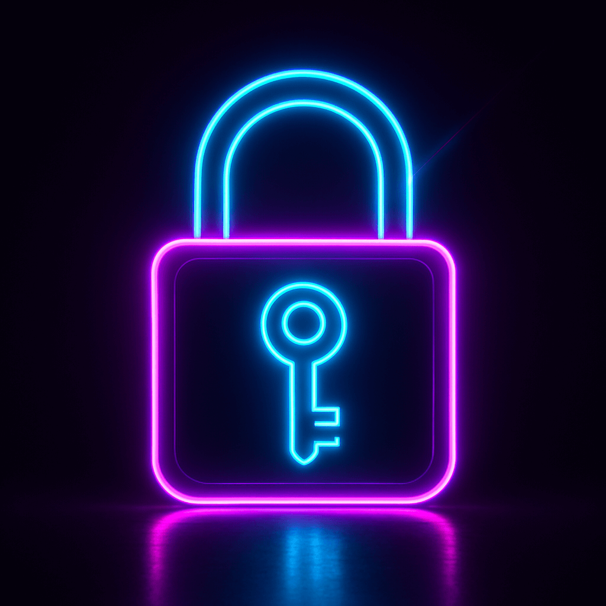
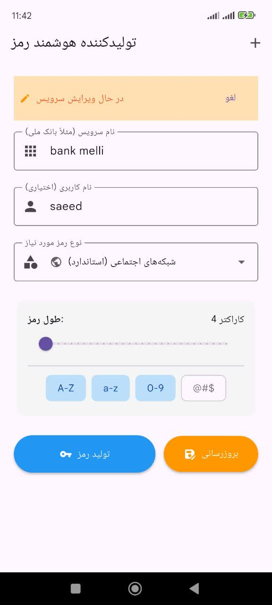
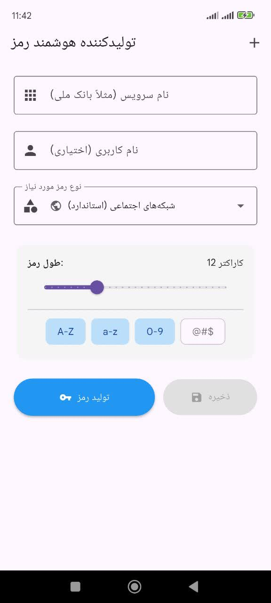
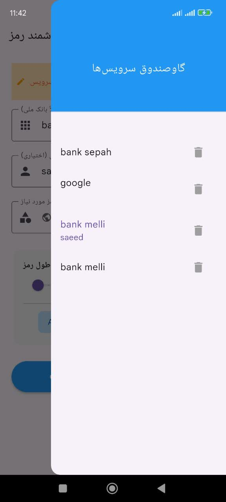

# قفل بان (PassForge)

  
  <h1>قفل بان</h1>
  
یک رمز اصلی → هزاران رمز قوی و متفاوت ۱۰۰٪ آفلاین • ورود با اثر انگشت • بدون ارسال رمز به سرور

## چرا قفل بان؟

- فقط یک رمز اصلی یادت باشه  
- برای هر سایت/اپ یک رمز متفاوت و فوق‌العاده قوی  
- رمزها هرگز از گوشی خارج نمی‌شن  
- ورود سریع با اثر انگشت یا چهره  
- همگام‌سازی امن لیست سرویس‌ها (نه رمزها!)  
- کاملاً فارسی و طراحی‌شده برای ایرانی‌ها

## اسکرین‌شات‌ها

  
  
  

## دانلود

- کافه‌بازار: در حال بررسی  
- دانلود مستقیم: [آخرین نسخه](https://github.com/b3hzadsh/pass-gen-flutter/releases/latest)

## توسعه‌دهنده

ساخته‌شده با ❤️ توسط یک توسعه‌دهنده مستقل ایرانی  
تماس: b3hzadsh@gmail.com

## لایسنس

این پروژه تحت لایسنس MIT منتشر شده است — آزاد برای استفاده، تغییر و توزیع.

---
⭐ اگر خوشت اومد، یه ستاره بده تا بقیه هم پیداش کنن!